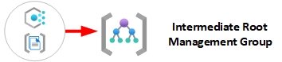

# Azure NoOps Mission Enclave Policy Terraform Modules

This folder contains the Terraform Modules for deploying Mission Enclave Policy Starter. See the [Deployment Guide for Terraform](../../docs/10-manual-deployment-guide-terraform.md) for detailed instructions on how to use the Modules.

> Please refer to [Policy Driven Governance](https://learn.microsoft.com/en-gb/azure/cloud-adoption-framework/ready/landing-zone/design-principles#policy-driven-governance) for further information.

> **IMPORTANT NOTE:** Azure NoOps Mission Enclave Policy starter is Zero Trust aligned by default, and occasionally we will rely on `-preview` policies in default assignments to meet core objectives. These preview policies are maintained by the Azure product owners and versioning is not in our control, however, we feel they are sufficiently important to be included in our releases. If the inclusion of preview policies is of concern, please review all default initiative assignments and remove any `-preview` policies that you are not comfortable with.

## FAQ

   We have added a dedicated [Azure NoOps Mission Enclave Policy starter FAQ](./11-Policies-FAQ) based on common issues raised or questions asked by customers and partners. Please review this section before raising an issue.

## Mission Enclave landing zones policies (Custom & Built-in)

As part of a default deployment configuration, policy and policy set definitions are deployed at multiple levels within the Mission Enclave landing zone Management Group hierarchy as depicted within the below diagram.

The subsequent sections will provide a summary of policy sets and policy set definitions applied at each level of the Management Group hierarchy.

>NOTE: Although the below sections will define which policy definitions/sets are applied at specific scopes, please remember that policy will inherit within your management group hierarchy.

## Policies included

There are around 12 custom Azure Policy Definitions included that are used from the [Azure NoOps Policy Overlay module](https://github.com/azurenoops/terraform-azurerm-overlays-policy) and around 12 Custom Azure Policy Initiatives included as part of the Azure NoOps Mission Enclave Policy starter implementation that adds on to those already built-in within each Azure customers tenant.

> Our goal is always to try and use built-in policies where available and also work with product teams to adopt our custom policies and make them built-in, which takes time. This means there will always be a requirement for custom policies.

### Intermediate Root

This management group is a parent to all the other management groups created within the default Azure landing zone configuration. Policy assignment is predominantly focused on assignment of security and monitoring best practices to ensure compliance and reduced operational overhead.

<table>
<tr><th>Management Group </th><th>Policy Configuration</th></tr>
<tr></tr>
<tr><td>
  

  
</td><td>
  
| **Policy Type**           | **Count** |
| :---                      |   :---:   |
| `Policy Definition Sets`  | **10**     |
| `Policy Definitions`      | **0**     |
</td></tr> </table>

The table below provides the specific **Custom** and **Built-in** **policy definitions sets** assigned at the **Intermediate Root Management Group**.

| Assignment Name                                                            | Definition Name                                                                  | Policy Type                           | Description                                                                                                                                                                                                                                                                                                                                                                          | Effect(s)                           |
| -------------------------------------------------------------------------- | -------------------------------------------------------------------------------- | ------------------------------------- | ------------------------------------------------------------------------------------------------------------------------------------------------------------------------------------------------------------------------------------------------------------------------------------------------------------------------------------------------------------------------------------ | ----------------------------------- |
| **General Governance**                      | **General Governance**                            | `Policy Definition Set`, **Custom**   | This policy set configures all the General settings, such as Allowed Virtual Machine Sizes, Allowed Regions, and Not Allowed Resource Types                                                                                                                                                                                                          | Modify                   |
| **Security Governance**                      | **Security Governance**                            | `Policy Definition Set`, **Custom**   | This policy set configures all the MDFC settings, such as Microsoft Defender for Cloud per individual service, Security contacts, and export from MDFC to Log Analytics workspace                                                                                                                                                                                               | AuditIfNotExists,DeployIfNotExists                   |
| **Configure Microsoft Defender for Databases to be enabled**                      | **Configure Microsoft Defender for Databases to be enabled**                            | `Policy Definition Set`, **Built-in**   | Configure Microsoft Defender for Databases to protect your Azure SQL Databases, Managed Instances, Open-source relational databases and Cosmos DB..                                                                                                                                                                                                            | DeployIfNotExists                   |
| **[Preview]: Deploy Microsoft Defender for Endpoint agent**                      | **[Preview]: Deploy Microsoft Defender for Endpoint agent**                            | `Policy Definition Set`, **Built-in**   | Deploy Microsoft Defender for Endpoint agent on applicable images.                                                                                                                                                                                                            | DeployIfNotExists                   |
| **Configure Advanced Threat Protection to be enabled on open-source relational databases**                                                   | **Configure Advanced Threat Protection to be enabled on open-source relational databases**                                 | `Policy Definition Set`, **Built-in**   | Enable Advanced Threat Protection on your non-Basic tier open-source relational databases to detect anomalous activities indicating unusual and potentially harmful attempts to access or exploit databases. See https://aka.ms/AzDforOpenSourceDBsDocu.                                                                                                                                                                                              | DeployIfNotExists                   |
| **Configure Azure Defender to be enabled on SQL Servers and SQL Managed Instances**                                                   | **Configure Azure Defender to be enabled on SQL Servers and SQL Managed Instances**                                 | `Policy Definition Set`, **Built-in**   | Enable Azure Defender on your SQL Servers and SQL Managed Instances to detect anomalous activities indicating unusual and potentially harmful attempts to access or exploit databases.                                                                                                                                                                                | DeployIfNotExists                   |
| **Monitoring Governance**                      | **Monitoring Governance**                            | `Policy Definition Set`, **Custom**   | This policy set configures all the Azure Monitor settings, such as Activity Log, Diagnostic Settings for Azure Services, Workspace Retention, Azure Monitor Baseline Alerts for Service Health and DenyAction Delete on Activity Log Settings and Diagnostic Settings.                                                                                                                                                                         | AuditIfNotExists,DeployIfNotExists                   |
| **Enable Azure Monitor for VMs**                                           | **Enable Azure Monitor for VMs**                                                 | `Policy Definition Set`, **Built-in** | Enable Azure Monitor for the virtual machines (VMs) in the specified scope (management group, subscription or resource group). Takes Log Analytics workspace as parameter                                                                                                                                                                                                            | DeployIfNotExists, AuditIfNotExists |
| **Enable Azure Monitor for Virtual Machine Scale Sets**                    | **Enable Azure Monitor for Virtual Machine Scale Sets**                          | `Policy Definition Set`, **Built-in** | Enable Azure Monitor for the Virtual Machine Scale Sets in the specified scope (Management group, Subscription or resource group). Takes Log Analytics workspace as parameter. Note: if your scale set upgradePolicy is set to Manual, you need to apply the extension to the all VMs in the set by calling upgrade on them. In CLI this would be az vmss update-instances.          | DeployIfNotExists, AuditIfNotExists |
| **Identity and Access Management Governance**                      | **Identity and Access Management Governance**                            | `Policy Definition Set`, **Custom**   | This policy set configures all the Identity and Access Management settings, such as Account management, Use private link to access Azure services                                                                                                                                                                                               | AuditIfNotExists,DeployIfNotExists                   |
| **Cost Management Governance**                      | **Cost Management Governance**                            | `Policy Definition Set`, **Custom**   | This policy set configures all the Cost Management settings, such as Budgets, and Audit Unused Resources                                                                                                                                                                  | AuditIfNotExists,DeployIfNotExists                   |
| **SQL Security Governance**                      | **SQL Security Governance**                            | `Policy Definition Set`, **Custom**   | This policy set configures all the SQL Security settings, such as SQL Security Alert Policies, SQL Transparent Encryption and SQL Auditing Settings                                                                                                                                                                      | AuditIfNotExists,DeployIfNotExists                   |